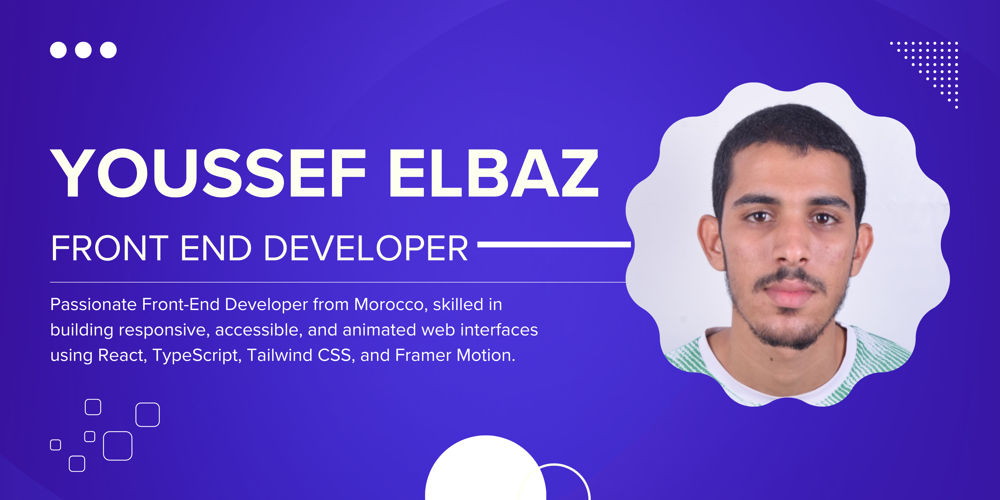

<h1 align="center">Hello, I'm Youssef Elbaz</h1>

  

  
  
  

---

## About Me

  

  

Hello There! 👋  
I'm a passionate **Front-End Developer** from **Morocco** 🇲🇦, focused on crafting clean, responsive, and interactive user interfaces. I specialize in building modern web experiences using **React**, **TypeScript**, **Tailwind CSS**, and **Framer Motion**. I love turning complex problems into elegant, accessible UI solutions, and I’m constantly learning and experimenting with new web technologies.

Whether it’s designing pixel-perfect layouts, optimizing performance, or animating delightful user flows. I enjoy every step of the front-end journey. Let’s build something awesome!

---

## Technologies & Tools

### Frontend

  
  
  
  
  
  
  
  

### Tools & Platforms

  
  
  

---

## GitHub Stats

   
  

---

## Education

| Year                         | Degree                  | Institution               |
|------------------------------|-------------------------|---------------------------|
|  | Génie informatique      | EST                   |
|  | Science physique Baccalauréat | Lycée Sidi Moussa El Hamri Agadir |

---

## Languages

  
  
  

---

## Open to Collaborations & New Projects

Whether you want to:

-  
    
  Build a web application  

-  
    
  Create a modern portfolio site  

-  
    
  Convert UI/UX designs to clean, efficient code  

-  
    
  Contribute to open-source projects  

Feel free to contact me — I’m always excited to collaborate and learn new things.

---

## Contact Me

  
  
  
  
  
  
  

---

  

